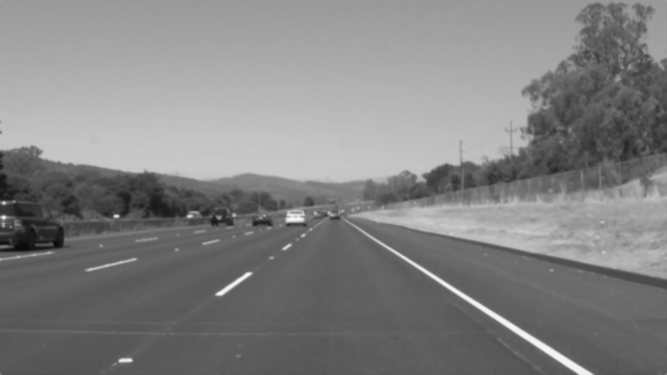
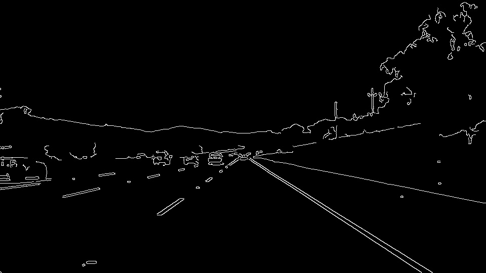
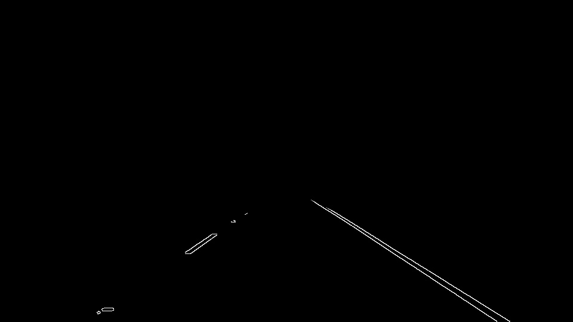
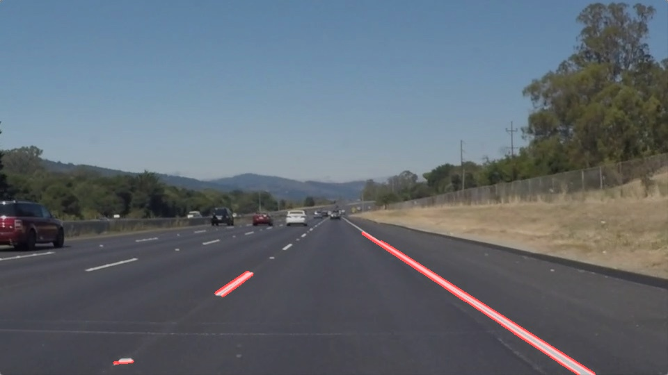
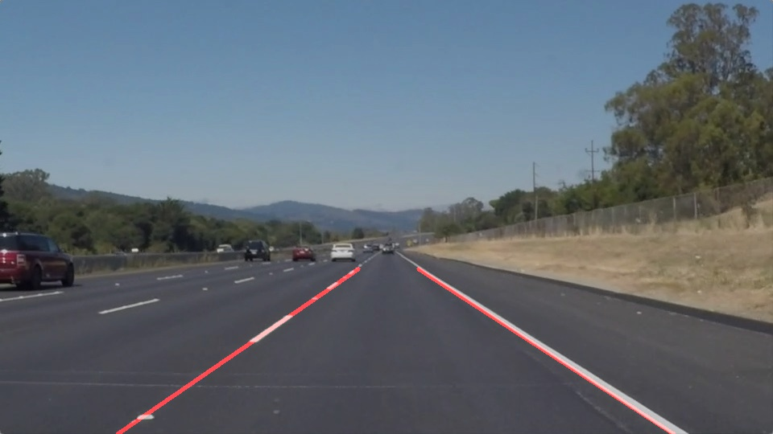

# **Finding Lane Lines on the Road** 

## Writeup 

---
**Finding Lane Lines on the Road**

The goals / steps of this project are the following:
* Make a pipeline that finds lane lines on the road
* Reflect on your work in a written report

[//]: # (Image References)

[image1]: ./examples/grayscale.jpg "Grayscale"
[image_result]: ./pipeline_images/result.jpg "Grayscale"
[image_result_old_line]: ./pipeline_images/result_old_line.jpg "Grayscale"
[image_new_line]: ./pipeline_images/new_line_img.jpg "Grayscale"
[image_line]: ./pipeline_images/line_img.jpg "Grayscale"
[image_roi]: ./pipeline_images/im_roi.jpg "Grayscale"
[image_canny]: ./pipeline_images/im_canny.jpg "Grayscale"
[image_blur]: ./pipeline_images/im_blur.jpg "Grayscale"
[image_ori]: ./test_images/solidWhiteRight.jpg "Grayscale"

---

### Reflection

### 1. Describe your pipeline. As part of the description, explain how you modified the draw_lines() function. The pipeline is as follows:

#### 0. We take `test_images/solidWhiteRight.jpg` as example

#### 1. Convert to grayscale and reduce noise with gauss blur
I used a gauss kernel with a size 5.

#### 2. Detect edges with Canny algrithm
The `canny_low_threshold = 50 canny_high_threshold = 150` are used for edge detection.

#### 3. Mask the image with ROI
After the edge detection, I used a polygon with four vertices. The bottom two vertices always have height of the image as `y` coordinates. The top two vertices have the same `y` coordinates. Instead of hardcoding the vertices, I use the factors between `0` and `1` relative to image width and height. This setting works well on the challenge video.

#### 4. Detect lines with Hough transformation

These parameters are used for Hough line detection. `rho=2, theta=math.pi / 180,  hough_thres=15, min_line_len=20, max_line_gap=10`

#### 5. Filter out unwanted lines and connect line segments

For each line segment found by Hough transform, I calculate the line parameters assuming the lines are defined with [Hesse normal form](https://en.wikipedia.org/wiki/Hesse_normal_form) with `rho` and `theta` as parameters.

  * Calculate `rho` and `theta` for each line segment. A very small float nummber `epsilon` is added for each division to avoid numerical error.
  * Keep only the lines with absolute value of `theta` between `min_theta=40` and `max_theta=60`. 
  * Put the lines into two groups base on its sign. Assuming that the left lane has a negative sign of `theta`, the right lane has a positve one.
  * For each line that still remains, calculate the intersection points with the top and bottom edges of the mask polygon. 
  * For each line group, I use a median filter to pick the intersection point for each edge. And take the two points as the final line. I use the median filter to filter out some potential noise line segments, which have a large margin to the center. 

With these methods, the pipeline works well on the challege video as well. 

### 2. Identify potential shortcomings with your current pipeline

There are some shortcommings that I noticed:
  * The pipeline is sensitive to the parameters, one have to tune the parameters with caution.
  * If the images shift, the ROI will fail to cover the lanes or some noise will be there, and the pipeline will fail to detect lanes. 
  * In the challege video, I noticed that there are some frames with low contrast, and the pileline dese not work very well at these frames for detecting yellow lines.

### 3. Suggest possible improvements to your pipeline

In my opition, the possible improvements would be

  * We may use the color (yellow and white) to filter image.
  * Make the ROI somehow adaptive.
  * Enhance the constrask, if, say, no lines are detected.
  * Interpolate the lines across frames.

